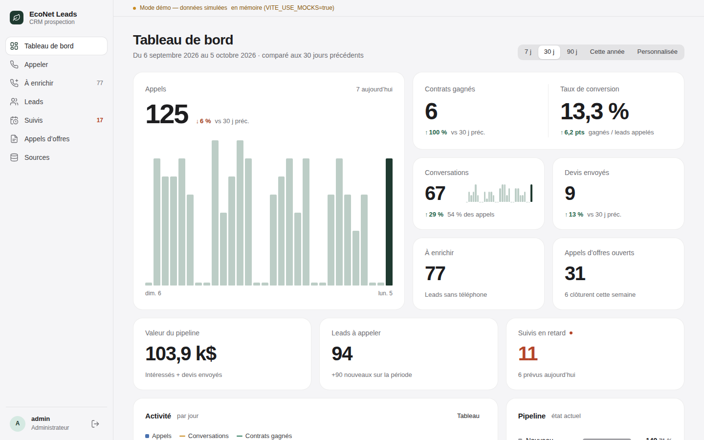
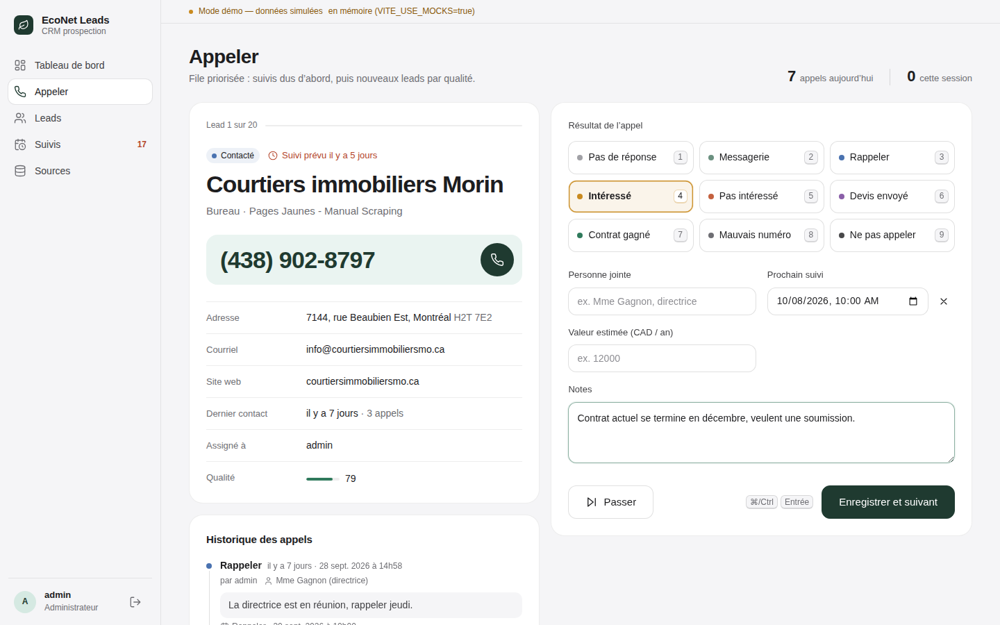
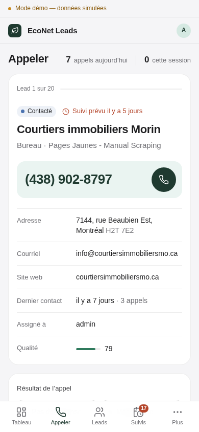
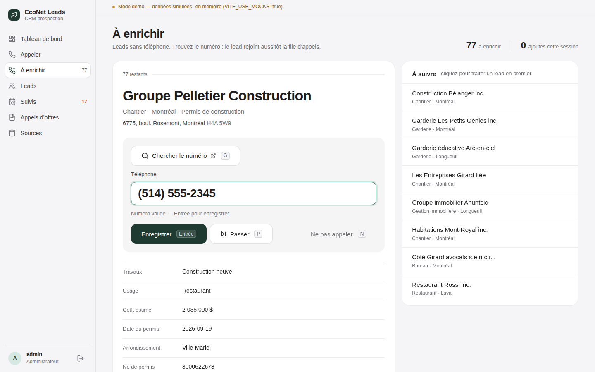
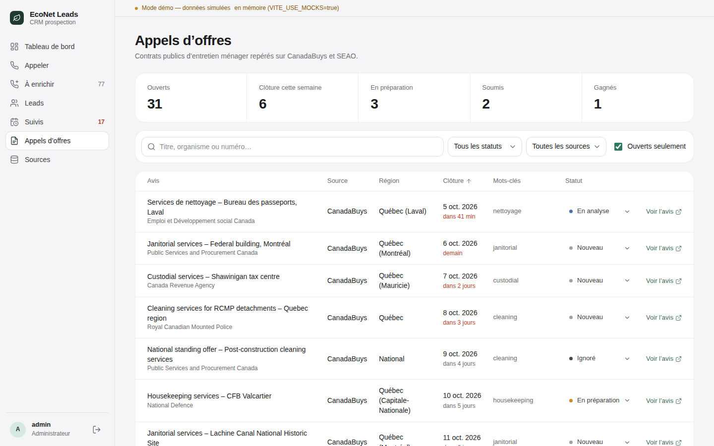
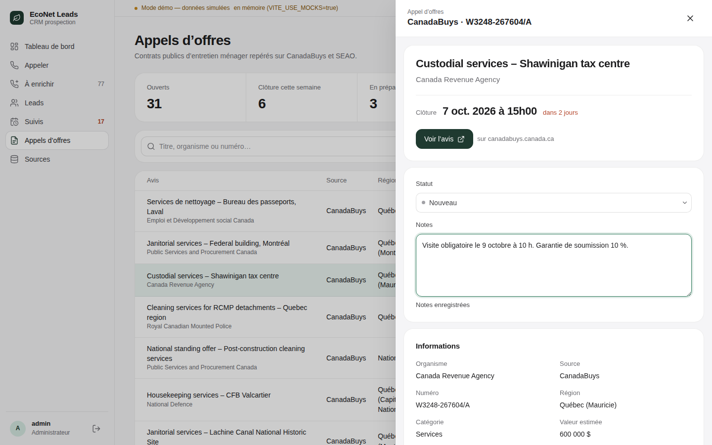

# EcoNet Leads — CRM & tableau de bord

Internal web app for EcoNet (commercial cleaning, Montréal) to work through Québec
businesses imported from open data, cold-call them, and track performance.

- **Appeler** (`/call`): prioritised call queue, one lead at a time, one-tap outcomes
  (keyboard shortcuts 1–9, Ctrl/⌘+Enter to save), follow-up scheduling, call history.
  Works well on a phone.
- **Leads** (`/leads`): server-side paged/sorted table, filters synced to the URL,
  CSV export, detail drawer (`/leads/:id`) with status change, value/assignee, timeline
  and "Appeler maintenant".
- **À enrichir** (`/enrich`): leads without a phone (business register, building permits…),
  one at a time. "Chercher le numéro" opens a Google search in a new tab; the phone field
  formats as you type ((514) 555-1234) and validates NANP numbers; Enter saves
  (`PATCH /api/businesses/{id}/phone`) and moves to the next lead, which joins the call
  queue. Keys work even while the phone field has focus: G search, P skip, N do-not-call.
  Leads without a phone also get the search + add-phone control in the lead drawer.
- **Suivis** (`/follow-ups`): follow-ups grouped as En retard / Aujourd'hui / Cette semaine.
- **Appels d'offres** (`/tenders`): public cleaning tenders from CanadaBuys and SEAO —
  summary strip, filters synced to the URL ("ouverts seulement" on by default), table by
  closing date with a countdown (red under 3 days), inline status, link to the notice,
  and a drawer (`/tenders/:id`) with status and notes (saved on blur or ⌘/Ctrl+Enter).
  Awarded SEAO contracts show their end / renewal date instead of a closing date.
- **Tableau de bord** (`/`): KPIs with comparison to the previous period, activity,
  pipeline, call outcomes, breakdown by type/city/source, team leaderboard.
- **Sources** (`/sources`, ADMIN): data sources, imports and job history (polls every 3 s
  while a job runs). The business register (`BULK_FILE`) also takes "Importer un fichier":
  the official ZIP (~225 MB) is uploaded with a progress bar, then imported server-side.

The UI is in French. It talks to the Spring Boot backend (`Econet-leads-backend`); the
API contract it is built against lives in the backend repo / project docs. Types in
`src/api/types.ts` mirror it.

| Screen | |
|---|---|
| Dashboard |  |
| Call screen |  |
| Call screen (mobile) |  |
| À enrichir |  |
| Appels d'offres |  |
| Tender detail |  |

More in [`docs/screenshots/`](docs/screenshots/).

## Stack

Vite + React 18 + TypeScript (strict), React Router 6, TanStack Query 5, Recharts,
date-fns (fr). Plain CSS with variables (no UI framework, inline SVG icons).

## Getting started

Requires Node 20+.

```bash
npm install
cp .env.example .env.local   # optional, see below
npm run dev                  # http://localhost:5173 — needs the backend on :8081 (its `local` profile)
npm run dev:mock             # http://localhost:5173 — no backend needed (demo data)
```

The dev server is pinned to port **5173** because the backend's default CORS config
allows `http://localhost:5173`.

### Running against the real backend locally

1. Start PostgreSQL and the backend with the `local` profile (see the backend README):
   `./mvnw spring-boot:run -Dspring-boot.run.profiles=local` → `http://localhost:8081`.
   That profile seeds ~60 demo leads (`dataSource = DEMO`) with 30 days of calls.
2. `npm run dev` (uses `.env.development` → `VITE_API_URL=http://localhost:8081`).
3. Log in as `admin` / `admin123` (local only), or `demo.agent1` / `demo1234` (caller),
   `demo.viewer` / `demo1234` (read-only).

### Environment variables

| Variable | Default | Description |
|---|---|---|
| `VITE_API_URL` | `http://localhost:8080` | Backend base URL, no trailing slash. Baked in at build time. |
| `VITE_USE_MOCKS` | `false` | `true` serves every API call from an in-memory mock. Dev only. |

`.env.development` (committed) keeps mocks **off**. `.env.mock` (committed) turns them
on and is used by `npm run dev:mock` (`vite --mode mock`). Put personal overrides in
`.env.local` / `.env.development.local` (git-ignored).

### Mock mode

`VITE_USE_MOCKS=true` installs a `fetch` interceptor (`src/mocks/`) that implements
every endpoint of the contract with ~150 generated Québec businesses (CPE, cliniques,
restaurants, bureaux… in Montréal, Laval, Longueuil, Québec, Gatineau, Sherbrooke…),
60 days of simulated calls, due/overdue follow-ups, data sources and import jobs, plus
~60 phone-less leads from the business register and Montréal building permits (with
`sourceDetails`) and ~40 CanadaBuys / SEAO tenders. Adding a phone moves the lead into the
call queue; numbers in the fictional 555-01xx range are rejected by the mock server so the
inline server-error state can be seen. ZIP uploads are simulated with progress.
State is kept in memory, so logging a call updates the queue, follow-ups and dashboard;
it resets on page reload. Token expiry (15 min) and refresh are simulated too.

Demo accounts: `admin` / `admin` (ADMIN), `marie.lavoie` / `demo` and `julien.roy` /
`demo` (USER), `lecteur` / `demo` (VIEWER, read-only).

The mock module is loaded with a dynamic `import()` behind
`import.meta.env.VITE_USE_MOCKS === 'true'`, which Vite replaces statically, so it is not
emitted in production builds.

## Scripts

| Script | What it does |
|---|---|
| `npm run dev` | Vite dev server on :5173 against `VITE_API_URL` |
| `npm run dev:mock` | Same, with the in-memory mock API |
| `npm run build` | `tsc -b` (strict type-check) then `vite build` into `dist/` |
| `npm run preview` | Serve `dist/` locally on :5173 |
| `npm run lint` | ESLint (flat config, typescript-eslint, react-hooks) |
| `npm test` | Vitest unit tests (API client refresh flow and uploads, formatting, phone formatter/validator, Google search URL, tender helpers) |

## Project layout

```
src/
  api/          client.ts (fetch wrapper, auth header, {error} parsing, 401 → refresh once → retry),
                session.ts (tokens in localStorage), endpoints.ts (typed calls), types.ts
  auth/         AuthContext (login/logout, role checks)
  components/   Layout (sidebar / mobile tab bar), OutcomeForm, LeadCard, CallHistory, Widget, …
  hooks/        useSavePhone, useUpdateTender (mutations shared by several screens)
  lib/          format.ts (CAD, %, phone, French relative dates), dates.ts, status.ts (fixed colours), leadFilters.ts,
                phone.ts (live formatting, validation, search link), tenders.ts (status meta, countdown, URL filters)
  mocks/        dev-only mock backend
  pages/        one file per screen (+ co-located CSS)
  styles/       global.css (design tokens)
```

Auth: tokens are stored in `localStorage`. On a 401 the client calls
`POST /api/auth/refresh` once (shared between concurrent requests) and retries; if that
fails the session is cleared and the route guard sends the user to `/login`.

## Deployment

The build output is a static single-page app (`dist/`). Any static host works; two
things matter:

1. **SPA fallback** — unknown paths must serve `index.html` (client-side routing).
   - Azure Static Web Apps: `public/staticwebapp.config.json` (copied into `dist/`) sets
     `navigationFallback`.
   - Netlify: `public/_redirects` contains `/* /index.html 200`.
2. **Backend URL & CORS** — set `VITE_API_URL` to the public backend URL *at build time*
   (e.g. in the Azure SWA / Netlify build environment), and add the site's origin
   (e.g. `https://leads.econet.ca`) to the backend's `CORS_ALLOWED_ORIGINS`.

Never set `VITE_USE_MOCKS=true` for a deployed build.

Example (Netlify): build command `npm run build`, publish directory `dist`, env
`VITE_API_URL=https://api.example.com`.
Example (Azure Static Web Apps): `app_location: "/"`, `output_location: "dist"`,
`app_build_command: "npm run build"`, with `VITE_API_URL` set in the workflow env.
